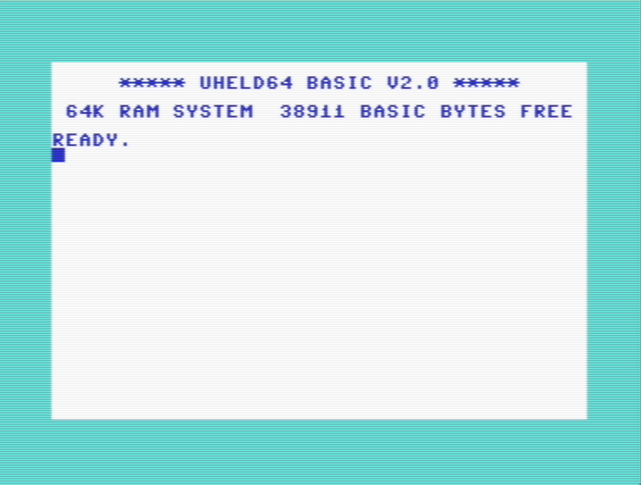

# CustomCommodoreRoms
Custom Commodore computers ROMs to be burnt to chips in retrocomputing projects.

Here is to store some of the possible alterations of these ROMs.

The files are based on the works of the defunct Commodore Business Corporation who made these computers 40+ years ago and hold no licenses.
Base unmodified commodore ROM dumps are available online at zimmers.net
https://www.zimmers.net/anonftp/pub/cbm/firmware/computers/c64/

The proposed files here all have been edited to add visual or functional changes.
Altering the Kernal trough an HEX editor has been demonstrated
https://wereallgeeks.wordpress.com/kernalmod/

These binary files comes with no warranty whatsoever. What worked for us may not work for you. Geek beware. You are the sole responsible for what happens with your projects.
https://wereallgeeks.wordpress.com/about/

# HandHeld variants of the SX64 Kernal
Custom ROMs to be used within the handheld project.
https://wereallgeeks.wordpress.com/uheld64-1/

A custom Kernal ROM has been created for the handheld project. It is based on the SX64 ROM 251104-04 ROM
it looks like this

Binary files are there: (https://github.com/wereallgeek/CustomCommodoreRoms/tree/main/Commodore64/Handheld)